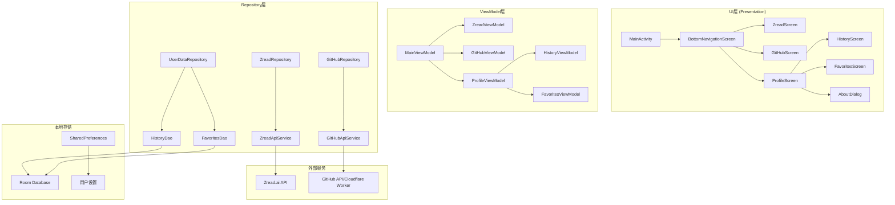
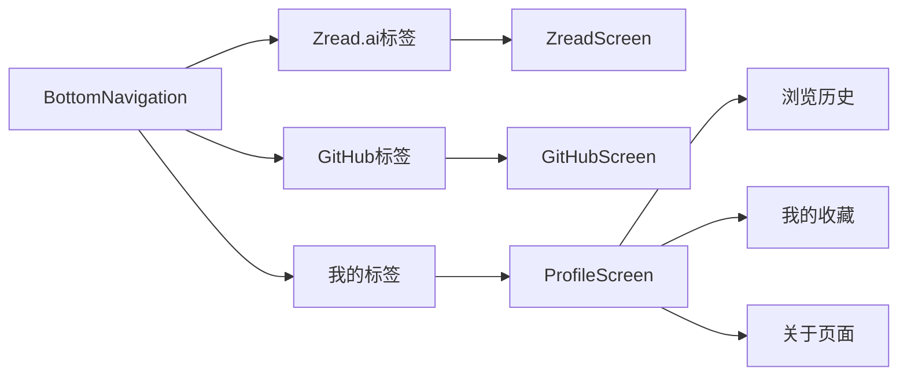

# 设计文档

## 概述

本设计文档基于现有的安卓GitHub热门仓库应用，添加底部标签导航功能。新架构将支持多数据源切换、本地数据管理（浏览历史、收藏）以及个人页面功能。设计采用MVVM架构模式，使用Jetpack Compose构建现代化的用户界面。

## 架构

### 整体架构图



### 导航架构



## 组件和接口

### 1. 主界面组件

#### MainActivity
```kotlin
@AndroidEntryPoint
class MainActivity : ComponentActivity() {
    override fun onCreate(savedInstanceState: Bundle?) {
        super.onCreate(savedInstanceState)
        setContent {
            GitHubTrendingTheme {
                MainScreen()
            }
        }
    }
}
```

#### MainScreen (底部导航容器)
```kotlin
@Composable
fun MainScreen(
    viewModel: MainViewModel = hiltViewModel()
) {
    val navController = rememberNavController()
    val currentRoute by navController.currentBackStackEntryAsState()
    
    Scaffold(
        bottomBar = {
            BottomNavigationBar(
                navController = navController,
                currentRoute = currentRoute?.destination?.route
            )
        }
    ) { paddingValues ->
        NavHost(
            navController = navController,
            startDestination = "zread",
            modifier = Modifier.padding(paddingValues)
        ) {
            composable("zread") { 
                ZreadScreen()
            }
            composable("github") { 
                GitHubScreen()
            }
            composable("profile") { 
                ProfileScreen()
            }
        }
    }
}
```

#### BottomNavigationBar
```kotlin
@Composable
fun BottomNavigationBar(
    navController: NavController,
    currentRoute: String?
) {
    val items = listOf(
        BottomNavItem("zread", "Zread.ai", Icons.Default.TrendingUp),
        BottomNavItem("github", "GitHub", Icons.Default.Code),
        BottomNavItem("profile", "我的", Icons.Default.Person)
    )
    
    NavigationBar {
        items.forEach { item ->
            NavigationBarItem(
                icon = { 
                    Icon(
                        imageVector = item.icon,
                        contentDescription = item.title
                    )
                },
                label = { Text(item.title) },
                selected = currentRoute == item.route,
                onClick = {
                    navController.navigate(item.route) {
                        popUpTo(navController.graph.findStartDestination().id) {
                            saveState = true
                        }
                        launchSingleTop = true
                        restoreState = true
                    }
                }
            )
        }
    }
}

data class BottomNavItem(
    val route: String,
    val title: String,
    val icon: ImageVector
)
```

### 2. Zread.ai标签页面

#### ZreadScreen
```kotlin
@Composable
fun ZreadScreen(
    viewModel: ZreadViewModel = hiltViewModel()
) {
    val uiState by viewModel.uiState.collectAsState()
    
    LaunchedEffect(Unit) {
        viewModel.loadZreadRepositories()
    }
    
    Column {
        // 顶部标题栏
        TopAppBar(
            title = { Text("Zread.ai 热门") }
        )
        
        // 内容区域
        when {
            uiState.isLoading -> LoadingIndicator()
            uiState.error != null -> ErrorMessage(
                error = uiState.error,
                onRetry = { viewModel.loadZreadRepositories() }
            )
            else -> {
                PullToRefreshLazyColumn(
                    items = uiState.repositories,
                    onRefresh = { viewModel.refreshRepositories() },
                    isRefreshing = uiState.isRefreshing
                ) { repository ->
                    RepositoryCard(
                        repository = repository,
                        onItemClick = { 
                            viewModel.onRepositoryClick(it)
                        },
                        onFavoriteClick = { 
                            viewModel.toggleFavorite(it)
                        },
                        isFavorited = uiState.favoriteIds.contains(repository.id)
                    )
                }
            }
        }
    }
}
```

#### ZreadViewModel
```kotlin
@HiltViewModel
class ZreadViewModel @Inject constructor(
    private val zreadRepository: ZreadRepository,
    private val userDataRepository: UserDataRepository,
    private val linkConverter: LinkConverter
) : ViewModel() {
    
    private val _uiState = MutableStateFlow(ZreadUiState())
    val uiState: StateFlow<ZreadUiState> = _uiState.asStateFlow()
    
    init {
        loadFavoriteIds()
    }
    
    fun loadZreadRepositories() {
        viewModelScope.launch {
            _uiState.value = _uiState.value.copy(isLoading = true, error = null)
            
            zreadRepository.getTrendingRepositories()
                .catch { exception ->
                    _uiState.value = _uiState.value.copy(
                        isLoading = false,
                        error = "Zread.ai服务暂时不可用：${exception.message}"
                    )
                }
                .collect { repositories ->
                    _uiState.value = _uiState.value.copy(
                        isLoading = false,
                        repositories = repositories
                    )
                }
        }
    }
    
    fun onRepositoryClick(repository: Repository) {
        viewModelScope.launch {
            // 保存到浏览历史
            userDataRepository.addToHistory(repository)
            
            // 打开链接（zread.ai数据源直接使用原链接）
            _uiState.value = _uiState.value.copy(
                openBrowserEvent = repository.url
            )
        }
    }
    
    fun toggleFavorite(repository: Repository) {
        viewModelScope.launch {
            if (_uiState.value.favoriteIds.contains(repository.id)) {
                userDataRepository.removeFromFavorites(repository.id)
            } else {
                userDataRepository.addToFavorites(repository)
            }
            loadFavoriteIds()
        }
    }
    
    private fun loadFavoriteIds() {
        viewModelScope.launch {
            userDataRepository.getFavoriteIds()
                .collect { ids ->
                    _uiState.value = _uiState.value.copy(favoriteIds = ids.toSet())
                }
        }
    }
}

data class ZreadUiState(
    val isLoading: Boolean = false,
    val isRefreshing: Boolean = false,
    val repositories: List<Repository> = emptyList(),
    val favoriteIds: Set<String> = emptySet(),
    val error: String? = null,
    val openBrowserEvent: String? = null
)
```

### 3. GitHub标签页面

#### GitHubScreen
```kotlin
@Composable
fun GitHubScreen(
    viewModel: GitHubViewModel = hiltViewModel()
) {
    val uiState by viewModel.uiState.collectAsState()
    
    LaunchedEffect(Unit) {
        viewModel.loadGitHubRepositories()
    }
    
    Column {
        TopAppBar(
            title = { Text("GitHub 热门") }
        )
        
        when {
            uiState.isLoading -> LoadingIndicator()
            uiState.error != null -> ErrorMessage(
                error = uiState.error,
                onRetry = { viewModel.loadGitHubRepositories() }
            )
            else -> {
                PullToRefreshLazyColumn(
                    items = uiState.repositories,
                    onRefresh = { viewModel.refreshRepositories() },
                    isRefreshing = uiState.isRefreshing
                ) { repository ->
                    RepositoryCard(
                        repository = repository,
                        onItemClick = { 
                            viewModel.onRepositoryClick(it)
                        },
                        onFavoriteClick = { 
                            viewModel.toggleFavorite(it)
                        },
                        isFavorited = uiState.favoriteIds.contains(repository.id)
                    )
                }
            }
        }
    }
}
```

#### GitHubViewModel
```kotlin
@HiltViewModel
class GitHubViewModel @Inject constructor(
    private val gitHubRepository: GitHubRepository,
    private val userDataRepository: UserDataRepository,
    private val linkConverter: LinkConverter
) : ViewModel() {
    
    private val _uiState = MutableStateFlow(GitHubUiState())
    val uiState: StateFlow<GitHubUiState> = _uiState.asStateFlow()
    
    fun onRepositoryClick(repository: Repository) {
        viewModelScope.launch {
            // 保存到浏览历史
            userDataRepository.addToHistory(repository)
            
            // 转换GitHub链接为zread.ai链接
            val convertedUrl = linkConverter.convertGitHubToZread(repository.url)
            _uiState.value = _uiState.value.copy(
                openBrowserEvent = convertedUrl
            )
        }
    }
    
    // 其他方法与ZreadViewModel类似
}
```

### 4. "我的"标签页面

#### ProfileScreen
```kotlin
@Composable
fun ProfileScreen(
    viewModel: ProfileViewModel = hiltViewModel()
) {
    val uiState by viewModel.uiState.collectAsState()
    var showAboutDialog by remember { mutableStateOf(false) }
    
    LazyColumn(
        modifier = Modifier.fillMaxSize(),
        contentPadding = PaddingValues(16.dp),
        verticalArrangement = Arrangement.spacedBy(16.dp)
    ) {
        // 用户信息区域
        item {
            Card {
                Column(
                    modifier = Modifier.padding(16.dp)
                ) {
                    Text(
                        text = "我的",
                        style = MaterialTheme.typography.headlineMedium
                    )
                    Text(
                        text = "管理你的浏览记录和收藏",
                        style = MaterialTheme.typography.bodyMedium,
                        color = MaterialTheme.colorScheme.onSurfaceVariant
                    )
                }
            }
        }
        
        // 浏览历史
        item {
            ProfileSection(
                title = "浏览历史",
                subtitle = "${uiState.historyCount} 个仓库",
                icon = Icons.Default.History,
                onClick = { viewModel.navigateToHistory() }
            )
        }
        
        // 我的收藏
        item {
            ProfileSection(
                title = "我的收藏",
                subtitle = "${uiState.favoritesCount} 个仓库",
                icon = Icons.Default.Favorite,
                onClick = { viewModel.navigateToFavorites() }
            )
        }
        
        // 关于
        item {
            ProfileSection(
                title = "关于",
                subtitle = "版本 ${BuildConfig.VERSION_NAME}",
                icon = Icons.Default.Info,
                onClick = { showAboutDialog = true }
            )
        }
    }
    
    if (showAboutDialog) {
        AboutDialog(
            onDismiss = { showAboutDialog = false }
        )
    }
}

@Composable
fun ProfileSection(
    title: String,
    subtitle: String,
    icon: ImageVector,
    onClick: () -> Unit
) {
    Card(
        modifier = Modifier
            .fillMaxWidth()
            .clickable { onClick() }
    ) {
        Row(
            modifier = Modifier
                .padding(16.dp)
                .fillMaxWidth(),
            verticalAlignment = Alignment.CenterVertically
        ) {
            Icon(
                imageVector = icon,
                contentDescription = title,
                tint = MaterialTheme.colorScheme.primary
            )
            
            Spacer(modifier = Modifier.width(16.dp))
            
            Column(modifier = Modifier.weight(1f)) {
                Text(
                    text = title,
                    style = MaterialTheme.typography.titleMedium
                )
                Text(
                    text = subtitle,
                    style = MaterialTheme.typography.bodyMedium,
                    color = MaterialTheme.colorScheme.onSurfaceVariant
                )
            }
            
            Icon(
                imageVector = Icons.Default.ChevronRight,
                contentDescription = "进入",
                tint = MaterialTheme.colorScheme.onSurfaceVariant
            )
        }
    }
}
```

### 5. 浏览历史页面

#### HistoryScreen
```kotlin
@Composable
fun HistoryScreen(
    viewModel: HistoryViewModel = hiltViewModel()
) {
    val uiState by viewModel.uiState.collectAsState()
    
    LaunchedEffect(Unit) {
        viewModel.loadHistory()
    }
    
    Column {
        TopAppBar(
            title = { Text("浏览历史") },
            navigationIcon = {
                IconButton(onClick = { /* 返回 */ }) {
                    Icon(Icons.Default.ArrowBack, contentDescription = "返回")
                }
            },
            actions = {
                if (uiState.history.isNotEmpty()) {
                    TextButton(
                        onClick = { viewModel.clearHistory() }
                    ) {
                        Text("清空")
                    }
                }
            }
        )
        
        when {
            uiState.isLoading -> LoadingIndicator()
            uiState.history.isEmpty() -> EmptyState(
                message = "暂无浏览历史",
                description = "你浏览过的仓库会显示在这里"
            )
            else -> {
                LazyColumn {
                    items(uiState.history) { historyItem ->
                        HistoryCard(
                            historyItem = historyItem,
                            onItemClick = { viewModel.onHistoryClick(it) },
                            onDeleteClick = { viewModel.deleteHistoryItem(it) }
                        )
                    }
                }
            }
        }
    }
}

@Composable
fun HistoryCard(
    historyItem: HistoryItem,
    onItemClick: (HistoryItem) -> Unit,
    onDeleteClick: (HistoryItem) -> Unit
) {
    Card(
        modifier = Modifier
            .fillMaxWidth()
            .padding(horizontal = 16.dp, vertical = 4.dp)
            .clickable { onItemClick(historyItem) }
    ) {
        Row(
            modifier = Modifier.padding(16.dp),
            verticalAlignment = Alignment.CenterVertically
        ) {
            Column(modifier = Modifier.weight(1f)) {
                Text(
                    text = historyItem.repository.fullName,
                    style = MaterialTheme.typography.titleMedium
                )
                Text(
                    text = historyItem.repository.description ?: "",
                    style = MaterialTheme.typography.bodyMedium,
                    maxLines = 2,
                    overflow = TextOverflow.Ellipsis
                )
                Text(
                    text = formatRelativeTime(historyItem.visitedAt),
                    style = MaterialTheme.typography.bodySmall,
                    color = MaterialTheme.colorScheme.onSurfaceVariant
                )
            }
            
            IconButton(
                onClick = { onDeleteClick(historyItem) }
            ) {
                Icon(
                    Icons.Default.Delete,
                    contentDescription = "删除",
                    tint = MaterialTheme.colorScheme.onSurfaceVariant
                )
            }
        }
    }
}
```

### 6. 收藏页面

#### FavoritesScreen
```kotlin
@Composable
fun FavoritesScreen(
    viewModel: FavoritesViewModel = hiltViewModel()
) {
    val uiState by viewModel.uiState.collectAsState()
    
    LaunchedEffect(Unit) {
        viewModel.loadFavorites()
    }
    
    Column {
        TopAppBar(
            title = { Text("我的收藏") },
            navigationIcon = {
                IconButton(onClick = { /* 返回 */ }) {
                    Icon(Icons.Default.ArrowBack, contentDescription = "返回")
                }
            }
        )
        
        when {
            uiState.isLoading -> LoadingIndicator()
            uiState.favorites.isEmpty() -> EmptyState(
                message = "暂无收藏",
                description = "收藏感兴趣的仓库，方便随时查看"
            )
            else -> {
                LazyColumn {
                    items(uiState.favorites) { favorite ->
                        RepositoryCard(
                            repository = favorite.repository,
                            onItemClick = { viewModel.onFavoriteClick(it) },
                            onFavoriteClick = { viewModel.removeFavorite(it) },
                            isFavorited = true
                        )
                    }
                }
            }
        }
    }
}
```

### 7. 关于对话框

#### AboutDialog
```kotlin
@Composable
fun AboutDialog(
    onDismiss: () -> Unit
) {
    AlertDialog(
        onDismissRequest = onDismiss,
        title = {
            Text("关于应用")
        },
        text = {
            Column {
                Text("GitHub 热门仓库")
                Spacer(modifier = Modifier.height(8.dp))
                Text("版本：${BuildConfig.VERSION_NAME}")
                Text("构建：${BuildConfig.VERSION_CODE}")
                Spacer(modifier = Modifier.height(16.dp))
                Text(
                    "发现最热门的开源项目，通过 zread.ai 获得更好的阅读体验。",
                    style = MaterialTheme.typography.bodyMedium
                )
            }
        },
        confirmButton = {
            TextButton(onClick = onDismiss) {
                Text("确定")
            }
        }
    )
}
```

## 数据模型

### 扩展的Repository模型
```kotlin
@Entity(tableName = "repositories")
data class Repository(
    @PrimaryKey val id: String,
    val name: String,
    val fullName: String,
    val description: String?,
    val url: String,
    val stars: Int,
    val language: String?,
    val authorName: String,
    val authorAvatar: String,
    val createdAt: String,
    val updatedAt: String,
    val source: DataSource = DataSource.GITHUB, // 新增：数据源标识
    @ColumnInfo(name = "cached_at") val cachedAt: Long = System.currentTimeMillis()
)

enum class DataSource {
    GITHUB, ZREAD_AI
}
```

### 浏览历史模型
```kotlin
@Entity(tableName = "history")
data class HistoryItem(
    @PrimaryKey val id: String = UUID.randomUUID().toString(),
    @Embedded val repository: Repository,
    @ColumnInfo(name = "visited_at") val visitedAt: Long = System.currentTimeMillis()
)

@Dao
interface HistoryDao {
    @Query("SELECT * FROM history ORDER BY visited_at DESC LIMIT 50")
    fun getAllHistory(): Flow<List<HistoryItem>>
    
    @Insert(onConflict = OnConflictStrategy.REPLACE)
    suspend fun insertHistory(historyItem: HistoryItem)
    
    @Query("DELETE FROM history WHERE repository_id = :repositoryId")
    suspend fun deleteByRepositoryId(repositoryId: String)
    
    @Query("DELETE FROM history")
    suspend fun clearAll()
    
    @Query("DELETE FROM history WHERE id NOT IN (SELECT id FROM history ORDER BY visited_at DESC LIMIT 50)")
    suspend fun deleteOldHistory()
}
```

### 收藏模型
```kotlin
@Entity(tableName = "favorites")
data class FavoriteItem(
    @PrimaryKey val id: String = UUID.randomUUID().toString(),
    @Embedded val repository: Repository,
    @ColumnInfo(name = "favorited_at") val favoritedAt: Long = System.currentTimeMillis()
)

@Dao
interface FavoritesDao {
    @Query("SELECT * FROM favorites ORDER BY favorited_at DESC")
    fun getAllFavorites(): Flow<List<FavoriteItem>>
    
    @Query("SELECT repository_id FROM favorites")
    fun getFavoriteIds(): Flow<List<String>>
    
    @Insert(onConflict = OnConflictStrategy.REPLACE)
    suspend fun insertFavorite(favoriteItem: FavoriteItem)
    
    @Query("DELETE FROM favorites WHERE repository_id = :repositoryId")
    suspend fun deleteByRepositoryId(repositoryId: String)
    
    @Query("SELECT COUNT(*) FROM favorites")
    suspend fun getFavoritesCount(): Int
}
```

### 数据库配置
```kotlin
@Database(
    entities = [Repository::class, HistoryItem::class, FavoriteItem::class],
    version = 2,
    exportSchema = false
)
@TypeConverters(Converters::class)
abstract class AppDatabase : RoomDatabase() {
    abstract fun repositoryDao(): RepositoryDao
    abstract fun historyDao(): HistoryDao
    abstract fun favoritesDao(): FavoritesDao
}
```

## 错误处理

### 网络错误处理策略
```kotlin
class NetworkErrorHandler {
    fun handleApiError(throwable: Throwable, source: DataSource): String {
        return when (throwable) {
            is UnknownHostException -> "网络连接失败，请检查网络设置"
            is SocketTimeoutException -> "请求超时，请稍后重试"
            is HttpException -> {
                when (throwable.code()) {
                    404 -> when (source) {
                        DataSource.ZREAD_AI -> "Zread.ai 服务暂时不可用"
                        DataSource.GITHUB -> "GitHub 数据不存在"
                    }
                    500 -> "${source.name} 服务器内部错误"
                    else -> "${source.name} 服务异常 (${throwable.code()})"
                }
            }
            else -> "未知错误：${throwable.message}"
        }
    }
}
```

## 测试策略

### 单元测试
```kotlin
@Test
fun `bottom navigation should maintain state when switching tabs`() = runTest {
    // Given
    val viewModel = MainViewModel()
    
    // When
    viewModel.selectTab("github")
    viewModel.selectTab("zread")
    
    // Then
    assertEquals("zread", viewModel.currentTab.value)
}

@Test
fun `history should be saved when repository is clicked`() = runTest {
    // Given
    val repository = createTestRepository()
    val userDataRepository = mockk<UserDataRepository>()
    val viewModel = ZreadViewModel(mockk(), userDataRepository, mockk())
    
    // When
    viewModel.onRepositoryClick(repository)
    
    // Then
    verify { userDataRepository.addToHistory(repository) }
}
```

### UI测试
```kotlin
@Test
fun bottomNavigation_switchesBetweenTabs() {
    composeTestRule.setContent {
        MainScreen()
    }
    
    // 点击GitHub标签
    composeTestRule
        .onNodeWithText("GitHub")
        .performClick()
    
    // 验证GitHub页面显示
    composeTestRule
        .onNodeWithText("GitHub 热门")
        .assertIsDisplayed()
    
    // 点击我的标签
    composeTestRule
        .onNodeWithText("我的")
        .performClick()
    
    // 验证个人页面显示
    composeTestRule
        .onNodeWithText("浏览历史")
        .assertIsDisplayed()
}
```

## 性能优化

### 内存管理
- 使用LazyColumn进行列表虚拟化
- 实现图片缓存和内存管理
- 合理使用ViewModel作用域避免内存泄漏

### 数据缓存策略
```kotlin
class CacheStrategy {
    companion object {
        const val CACHE_EXPIRE_TIME = 5 * 60 * 1000L // 5分钟
        const val MAX_HISTORY_SIZE = 50
        const val MAX_CACHE_SIZE = 100
    }
    
    fun shouldRefreshCache(lastCacheTime: Long): Boolean {
        return System.currentTimeMillis() - lastCacheTime > CACHE_EXPIRE_TIME
    }
}
```

### 网络优化
- 实现智能缓存策略
- 使用OkHttp连接池
- 添加请求去重机制

## 安全考虑

### 数据安全
- 本地数据库使用SQLCipher加密（可选）
- 敏感信息不存储在明文中
- 实现数据备份和恢复机制

### 网络安全
```xml
<!-- network_security_config.xml -->
<network-security-config>
    <domain-config cleartextTrafficPermitted="false">
        <domain includeSubdomains="true">zread.ai</domain>
        <domain includeSubdomains="true">github.com</domain>
        <domain includeSubdomains="true">api.github.com</domain>
    </domain-config>
</network-security-config>
```

## 部署配置

### Gradle依赖更新
```kotlin
dependencies {
    // Navigation
    implementation "androidx.navigation:navigation-compose:$nav_version"
    
    // Bottom Navigation
    implementation "androidx.compose.material3:material3:$material3_version"
    
    // Room Database (更新版本)
    implementation "androidx.room:room-runtime:$room_version"
    implementation "androidx.room:room-ktx:$room_version"
    kapt "androidx.room:room-compiler:$room_version"
    
    // 其他现有依赖...
}
```

### 版本管理
```kotlin
// build.gradle.kts (app level)
android {
    defaultConfig {
        versionCode 2
        versionName "2.0.0"
    }
}
```

这个设计文档提供了完整的技术实现方案，包括UI组件、数据管理、导航架构等所有必要的技术细节。