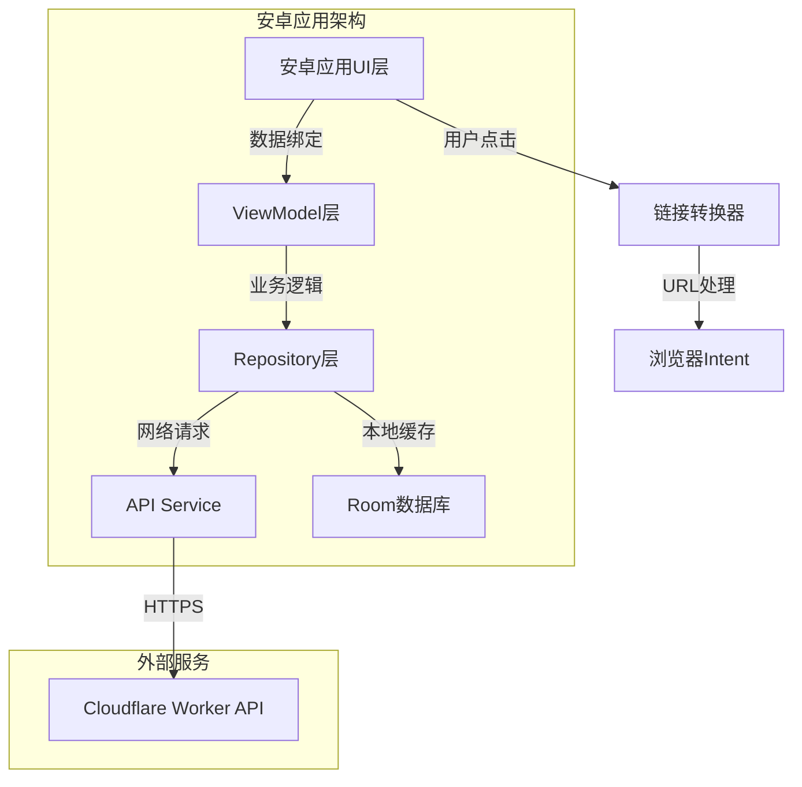

# 设计文档

## 概述

本安卓应用采用现代Android开发架构，使用MVVM模式和Jetpack组件。应用将复用现有的Cloudflare Worker API服务，主要功能是展示GitHub热门仓库，并在用户点击时将GitHub链接转换为zread.ai链接以提供增强阅读体验。

## 架构

### 应用架构图



### 技术栈
- **开发语言**: Kotlin
- **UI框架**: Jetpack Compose
- **架构模式**: MVVM + Repository Pattern
- **网络库**: Retrofit + OkHttp
- **异步处理**: Kotlin Coroutines + Flow
- **依赖注入**: Hilt
- **本地存储**: Room Database
- **图片加载**: Coil

## 组件和接口

### 1. UI层 (Presentation Layer)

#### MainActivity
```kotlin
@AndroidEntryPoint
class MainActivity : ComponentActivity() {
    override fun onCreate(savedInstanceState: Bundle?) {
        super.onCreate(savedInstanceState)
        setContent {
            GitHubTrendingTheme {
                TrendingScreen()
            }
        }
    }
}
```

#### TrendingScreen (Compose)
```kotlin
@Composable
fun TrendingScreen(
    viewModel: TrendingViewModel = hiltViewModel()
) {
    val uiState by viewModel.uiState.collectAsState()
    
    LazyColumn {
        items(uiState.repositories) { repo ->
            RepositoryCard(
                repository = repo,
                onItemClick = { viewModel.onRepositoryClick(it) }
            )
        }
    }
}
```

#### RepositoryCard组件
```kotlin
@Composable
fun RepositoryCard(
    repository: Repository,
    onItemClick: (Repository) -> Unit
) {
    Card(
        modifier = Modifier
            .fillMaxWidth()
            .padding(8.dp)
            .clickable { onItemClick(repository) },
        elevation = CardDefaults.cardElevation(defaultElevation = 4.dp)
    ) {
        Column(modifier = Modifier.padding(16.dp)) {
            // 仓库名称和作者
            Text(
                text = repository.fullName,
                style = MaterialTheme.typography.headlineSmall
            )
            
            // 描述
            Text(
                text = repository.description ?: "",
                style = MaterialTheme.typography.bodyMedium
            )
            
            // 星标数和语言
            Row {
                LanguageChip(language = repository.language)
                Spacer(modifier = Modifier.width(8.dp))
                StarCount(count = repository.stars)
            }
        }
    }
}
```

### 2. ViewModel层

#### TrendingViewModel
```kotlin
@HiltViewModel
class TrendingViewModel @Inject constructor(
    private val repository: TrendingRepository,
    private val linkConverter: LinkConverter
) : ViewModel() {
    
    private val _uiState = MutableStateFlow(TrendingUiState())
    val uiState: StateFlow<TrendingUiState> = _uiState.asStateFlow()
    
    init {
        loadTrendingRepositories()
    }
    
    fun loadTrendingRepositories() {
        viewModelScope.launch {
            _uiState.value = _uiState.value.copy(isLoading = true)
            
            repository.getTrendingRepositories()
                .catch { exception ->
                    _uiState.value = _uiState.value.copy(
                        isLoading = false,
                        error = exception.message
                    )
                }
                .collect { repositories ->
                    _uiState.value = _uiState.value.copy(
                        isLoading = false,
                        repositories = repositories,
                        error = null
                    )
                }
        }
    }
    
    fun onRepositoryClick(repository: Repository) {
        val convertedUrl = linkConverter.convertGitHubToZread(repository.url)
        // 触发浏览器打开事件
        _uiState.value = _uiState.value.copy(
            openBrowserEvent = convertedUrl
        )
    }
    
    fun onRefresh() {
        loadTrendingRepositories()
    }
}
```

#### UI状态数据类
```kotlin
data class TrendingUiState(
    val isLoading: Boolean = false,
    val repositories: List<Repository> = emptyList(),
    val error: String? = null,
    val openBrowserEvent: String? = null
)
```

### 3. Repository层 (数据层)

#### TrendingRepository
```kotlin
@Singleton
class TrendingRepository @Inject constructor(
    private val apiService: GitHubTrendingApiService,
    private val localDataSource: TrendingLocalDataSource
) {
    
    fun getTrendingRepositories(): Flow<List<Repository>> = flow {
        try {
            // 先发射缓存数据
            val cachedData = localDataSource.getCachedRepositories()
            if (cachedData.isNotEmpty()) {
                emit(cachedData)
            }
            
            // 然后获取最新数据
            val remoteData = apiService.getTrendingRepositories()
            localDataSource.saveRepositories(remoteData.repositories)
            emit(remoteData.repositories)
            
        } catch (exception: Exception) {
            // 如果网络请求失败，尝试使用缓存数据
            val cachedData = localDataSource.getCachedRepositories()
            if (cachedData.isNotEmpty()) {
                emit(cachedData)
            } else {
                throw exception
            }
        }
    }
}
```

### 4. 网络层

#### API Service接口
```kotlin
interface GitHubTrendingApiService {
    @GET("api/trending")
    suspend fun getTrendingRepositories(): TrendingResponse
    
    @GET("api/trending")
    suspend fun getTrendingRepositories(@Query("date") date: String): TrendingResponse
}
```

#### Retrofit配置
```kotlin
@Module
@InstallIn(SingletonComponent::class)
object NetworkModule {
    
    @Provides
    @Singleton
    fun provideOkHttpClient(): OkHttpClient {
        return OkHttpClient.Builder()
            .addInterceptor(HttpLoggingInterceptor().apply {
                level = HttpLoggingInterceptor.Level.BODY
            })
            .connectTimeout(30, TimeUnit.SECONDS)
            .readTimeout(30, TimeUnit.SECONDS)
            .build()
    }
    
    @Provides
    @Singleton
    fun provideRetrofit(okHttpClient: OkHttpClient): Retrofit {
        return Retrofit.Builder()
            .baseUrl("https://your-domain.com/")
            .client(okHttpClient)
            .addConverterFactory(GsonConverterFactory.create())
            .build()
    }
    
    @Provides
    @Singleton
    fun provideApiService(retrofit: Retrofit): GitHubTrendingApiService {
        return retrofit.create(GitHubTrendingApiService::class.java)
    }
}
```

### 5. 链接转换器

#### LinkConverter
```kotlin
@Singleton
class LinkConverter @Inject constructor() {
    
    fun convertGitHubToZread(githubUrl: String): String {
        return try {
            if (githubUrl.startsWith("https://github.com/")) {
                githubUrl.replace("https://github.com/", "https://zread.ai/")
            } else {
                // 如果不是标准GitHub链接，返回原链接
                githubUrl
            }
        } catch (exception: Exception) {
            // 转换失败时返回原链接
            githubUrl
        }
    }
    
    fun isValidGitHubUrl(url: String): Boolean {
        return url.matches(Regex("^https://github\\.com/[\\w.-]+/[\\w.-]+/?$"))
    }
}
```

## 数据模型

### Repository数据类
```kotlin
@Entity(tableName = "repositories")
data class Repository(
    @PrimaryKey val id: String,
    val name: String,
    val fullName: String,
    val description: String?,
    val url: String,
    val stars: Int,
    val language: String?,
    val authorName: String,
    val authorAvatar: String,
    val createdAt: String,
    val updatedAt: String,
    @ColumnInfo(name = "cached_at") val cachedAt: Long = System.currentTimeMillis()
)

data class Author(
    val name: String,
    val avatar: String
)

data class TrendingResponse(
    val date: String,
    val repositories: List<Repository>,
    val total: Int
)
```

### Room数据库配置
```kotlin
@Database(
    entities = [Repository::class],
    version = 1,
    exportSchema = false
)
@TypeConverters(Converters::class)
abstract class TrendingDatabase : RoomDatabase() {
    abstract fun repositoryDao(): RepositoryDao
}

@Dao
interface RepositoryDao {
    @Query("SELECT * FROM repositories ORDER BY stars DESC")
    suspend fun getAllRepositories(): List<Repository>
    
    @Insert(onConflict = OnConflictStrategy.REPLACE)
    suspend fun insertRepositories(repositories: List<Repository>)
    
    @Query("DELETE FROM repositories WHERE cached_at < :expireTime")
    suspend fun deleteExpiredRepositories(expireTime: Long)
}
```

## 错误处理

### 网络错误处理
```kotlin
sealed class NetworkResult<T> {
    data class Success<T>(val data: T) : NetworkResult<T>()
    data class Error<T>(val exception: Throwable) : NetworkResult<T>()
    data class Loading<T>(val isLoading: Boolean = true) : NetworkResult<T>()
}

class NetworkErrorHandler {
    fun handleError(throwable: Throwable): String {
        return when (throwable) {
            is UnknownHostException -> "网络连接失败，请检查网络设置"
            is SocketTimeoutException -> "请求超时，请稍后重试"
            is HttpException -> {
                when (throwable.code()) {
                    404 -> "请求的数据不存在"
                    500 -> "服务器内部错误"
                    else -> "网络请求失败 (${throwable.code()})"
                }
            }
            else -> "未知错误：${throwable.message}"
        }
    }
}
```

### UI错误状态处理
```kotlin
@Composable
fun ErrorMessage(
    error: String,
    onRetry: () -> Unit
) {
    Column(
        modifier = Modifier
            .fillMaxSize()
            .padding(16.dp),
        horizontalAlignment = Alignment.CenterHorizontally,
        verticalArrangement = Arrangement.Center
    ) {
        Text(
            text = error,
            style = MaterialTheme.typography.bodyLarge,
            textAlign = TextAlign.Center
        )
        
        Spacer(modifier = Modifier.height(16.dp))
        
        Button(onClick = onRetry) {
            Text("重试")
        }
    }
}
```

## 测试策略

### 单元测试
```kotlin
@Test
fun `convertGitHubToZread should replace github domain with zread domain`() {
    // Given
    val linkConverter = LinkConverter()
    val githubUrl = "https://github.com/user/repo"
    
    // When
    val result = linkConverter.convertGitHubToZread(githubUrl)
    
    // Then
    assertEquals("https://zread.ai/user/repo", result)
}

@Test
fun `getTrendingRepositories should return cached data when network fails`() = runTest {
    // Given
    val mockApiService = mockk<GitHubTrendingApiService>()
    val mockLocalDataSource = mockk<TrendingLocalDataSource>()
    val repository = TrendingRepository(mockApiService, mockLocalDataSource)
    
    every { mockApiService.getTrendingRepositories() } throws UnknownHostException()
    every { mockLocalDataSource.getCachedRepositories() } returns listOf(mockRepository)
    
    // When
    val result = repository.getTrendingRepositories().first()
    
    // Then
    assertEquals(1, result.size)
}
```

### UI测试
```kotlin
@Test
fun repositoryCard_displaysCorrectInformation() {
    composeTestRule.setContent {
        RepositoryCard(
            repository = testRepository,
            onItemClick = {}
        )
    }
    
    composeTestRule
        .onNodeWithText(testRepository.fullName)
        .assertIsDisplayed()
    
    composeTestRule
        .onNodeWithText(testRepository.description!!)
        .assertIsDisplayed()
}
```

## 性能优化

### 列表性能优化
- 使用LazyColumn进行虚拟化滚动
- 实现图片懒加载和缓存
- 使用Compose的key参数优化重组

### 内存管理
- 使用Coil进行图片内存管理
- 实现数据库缓存过期清理
- 合理使用ViewModel作用域

### 网络优化
- 实现请求缓存策略
- 使用OkHttp连接池
- 添加请求重试机制

## 安全考虑

### 网络安全
- 强制使用HTTPS
- 验证SSL证书
- 添加网络安全配置

### 数据安全
- 本地数据库加密（如需要）
- 敏感信息不存储在SharedPreferences
- 验证API响应数据格式

### 权限管理
```xml
<!-- AndroidManifest.xml -->
<uses-permission android:name="android.permission.INTERNET" />
<uses-permission android:name="android.permission.ACCESS_NETWORK_STATE" />

<application
    android:usesCleartextTraffic="false"
    android:networkSecurityConfig="@xml/network_security_config">
</application>
```

## 部署配置

### Gradle配置
```kotlin
// app/build.gradle.kts
android {
    compileSdk 34
    
    defaultConfig {
        applicationId "com.example.githubtrending"
        minSdk 24
        targetSdk 34
        versionCode 1
        versionName "1.0"
    }
    
    buildFeatures {
        compose = true
    }
    
    compileOptions {
        sourceCompatibility = JavaVersion.VERSION_1_8
        targetCompatibility = JavaVersion.VERSION_1_8
    }
}

dependencies {
    implementation "androidx.compose.ui:ui:$compose_version"
    implementation "androidx.compose.material3:material3:$material3_version"
    implementation "androidx.lifecycle:lifecycle-viewmodel-compose:$lifecycle_version"
    implementation "com.squareup.retrofit2:retrofit:$retrofit_version"
    implementation "com.google.dagger:hilt-android:$hilt_version"
    implementation "androidx.room:room-runtime:$room_version"
    implementation "io.coil-kt:coil-compose:$coil_version"
}
```