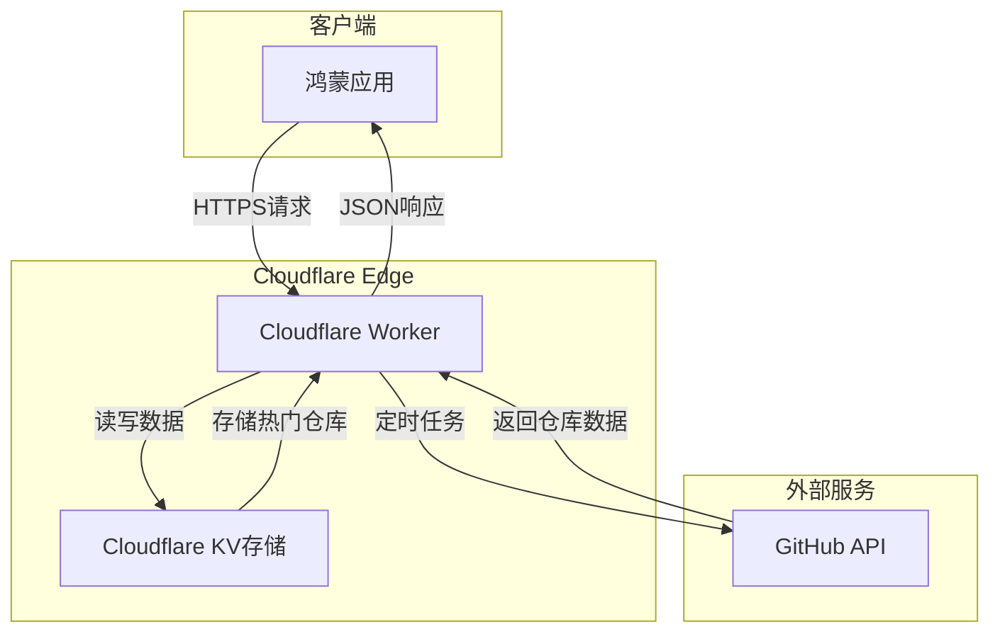

# 设计文档

## 概述

本系统采用微服务架构，包含三个主要组件：
1. **Cloudflare Worker API服务** - 负责数据抓取、存储和API服务
2. **GitHub数据抓取模块** - 定时获取热门仓库数据
3. **鸿蒙移动应用** - 用户界面和交互

系统使用Cloudflare KV作为数据存储，通过定时任务实现自动化数据更新。

## 架构

### 系统架构图



### 数据流程

1. **数据抓取流程**：定时任务 → GitHub API → 数据处理 → KV存储
2. **API服务流程**：鸿蒙应用 → Worker API → KV存储 → JSON响应
3. **用户交互流程**：用户操作 → 应用界面 → API请求 → 数据展示

## 组件和接口

### 1. Cloudflare Worker API服务

#### 核心模块
- **路由处理器** (`router.js`)
  - 处理API路由：`/api/trending`、`/api/trending/:date`
  - CORS配置和错误处理
  
- **数据抓取器** (`scraper.js`)
  - GitHub API客户端
  - 数据转换和清洗
  - 错误重试机制

- **存储管理器** (`storage.js`)
  - KV存储操作封装
  - 数据序列化/反序列化
  - 缓存策略实现

#### API接口设计

```typescript
// GET /api/trending
interface TrendingResponse {
  date: string;
  repositories: Repository[];
  total: number;
}

// GET /api/trending?date=2024-01-01
interface Repository {
  id: string;
  name: string;
  fullName: string;
  description: string;
  url: string;
  stars: number;
  language: string;
  author: {
    name: string;
    avatar: string;
  };
  createdAt: string;
  updatedAt: string;
}
```

### 2. GitHub数据抓取模块

#### 抓取策略
- **数据源**：GitHub Search API (`/search/repositories`)
- **查询参数**：
  - `q`: `created:>YYYY-MM-DD` (最近创建的仓库)
  - `sort`: `stars` (按星标排序)
  - `order`: `desc` (降序)
  - `per_page`: `50` (每页50个)

#### 数据处理流程
```javascript
// 伪代码示例
async function fetchTrendingRepos(date) {
  const query = `created:>${date} stars:>10`;
  const response = await fetch(`https://api.github.com/search/repositories?q=${query}&sort=stars&order=desc`);
  const data = await response.json();
  
  return data.items.map(repo => ({
    id: repo.id,
    name: repo.name,
    fullName: repo.full_name,
    description: repo.description,
    url: repo.html_url,
    stars: repo.stargazers_count,
    language: repo.language,
    author: {
      name: repo.owner.login,
      avatar: repo.owner.avatar_url
    }
  }));
}
```

### 3. 鸿蒙移动应用

#### 应用架构
- **MVVM架构模式**
- **模块化设计**：网络层、数据层、UI层分离

#### 核心组件

**网络服务层** (`NetworkService.ets`)
```typescript
export class NetworkService {
  private baseUrl: string = 'https://your-domain.com';
  
  async getTrendingRepos(date?: string): Promise<TrendingResponse> {
    const url = date ? `${this.baseUrl}/api/trending?date=${date}` : `${this.baseUrl}/api/trending`;
    // HTTP请求实现
  }
}
```

**数据模型** (`Models.ets`)
```typescript
export interface Repository {
  id: string;
  name: string;
  fullName: string;
  description: string;
  url: string;
  stars: number;
  language: string;
  author: Author;
}

export interface Author {
  name: string;
  avatar: string;
}
```

**主页面** (`MainPage.ets`)
- 使用List组件展示仓库列表
- 实现下拉刷新功能
- 集成加载状态管理

**仓库卡片组件** (`RepoCard.ets`)
- 展示仓库基本信息
- 支持点击跳转
- 语言标签颜色区分

## 数据模型

### KV存储结构

```javascript
// 键值对结构
{
  // 每日数据
  "trending:2024-01-01": {
    "date": "2024-01-01",
    "repositories": [...],
    "updatedAt": "2024-01-01T10:00:00Z"
  },
  
  // 最新数据快速访问
  "trending:latest": {
    "date": "2024-01-01",
    "repositories": [...],
    "updatedAt": "2024-01-01T10:00:00Z"
  }
}
```

### 数据生命周期
- **保留期限**：7天历史数据
- **更新频率**：每日UTC 00:00自动更新
- **缓存策略**：客户端缓存1小时，服务端永久缓存直到下次更新

## 错误处理

### API错误处理
```javascript
// 统一错误响应格式
{
  "error": {
    "code": "GITHUB_API_ERROR",
    "message": "GitHub API请求失败",
    "details": "Rate limit exceeded"
  },
  "timestamp": "2024-01-01T10:00:00Z"
}
```

### 错误类型定义
- `GITHUB_API_ERROR`: GitHub API调用失败
- `STORAGE_ERROR`: KV存储操作失败
- `VALIDATION_ERROR`: 请求参数验证失败
- `NOT_FOUND`: 请求的数据不存在

### 鸿蒙应用错误处理
- **网络错误**：显示重试按钮和离线提示
- **数据解析错误**：显示"数据格式错误"提示
- **服务器错误**：显示"服务暂时不可用"提示

## 测试策略

### 单元测试
- **Worker函数测试**：使用Miniflare进行本地测试
- **数据处理测试**：验证GitHub API数据转换逻辑
- **存储操作测试**：模拟KV存储操作

### 集成测试
- **API端到端测试**：验证完整的请求-响应流程
- **定时任务测试**：验证数据抓取和存储流程
- **跨域请求测试**：验证CORS配置

### 鸿蒙应用测试
- **UI组件测试**：验证界面渲染和交互
- **网络请求测试**：模拟各种网络状况
- **数据绑定测试**：验证数据展示逻辑

### 性能测试
- **API响应时间**：目标 < 500ms
- **数据抓取效率**：完整抓取 < 30秒
- **应用启动时间**：目标 < 2秒

## 部署和配置

### Cloudflare Worker配置
```javascript
// wrangler.toml
name = "github-trending-api"
main = "src/index.js"
compatibility_date = "2024-01-01"

[triggers]
crons = ["0 0 * * *"]  // 每日UTC 00:00执行

[[kv_namespaces]]
binding = "TRENDING_KV"
id = "your-kv-namespace-id"
```

### 环境变量
- `GITHUB_TOKEN`: GitHub API访问令牌
- `CUSTOM_DOMAIN`: 自定义域名配置
- `CORS_ORIGINS`: 允许的跨域来源

### 鸿蒙应用配置
```json
// module.json5
{
  "module": {
    "requestPermissions": [
      {
        "name": "ohos.permission.INTERNET"
      }
    ]
  }
}
```

## 安全考虑

### API安全
- **速率限制**：防止API滥用
- **CORS配置**：限制跨域访问来源
- **输入验证**：验证所有请求参数

### 数据安全
- **敏感信息保护**：GitHub Token安全存储
- **数据传输加密**：强制HTTPS通信
- **访问控制**：KV存储权限最小化

### 鸿蒙应用安全
- **网络安全**：验证SSL证书
- **数据验证**：验证API响应数据格式
- **权限最小化**：仅请求必要的系统权限